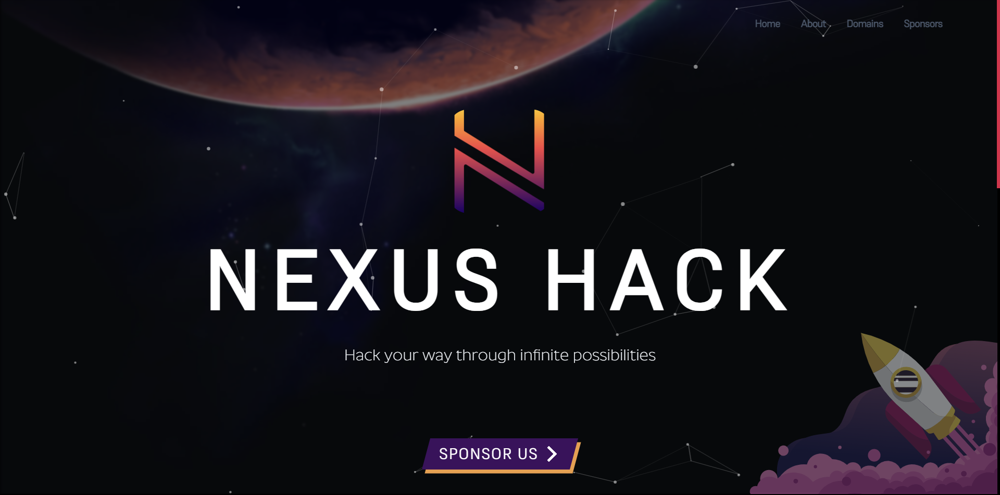

# [Nexus Hack](https://nexushack.vercel.app)

This is the official Nexus Hack repository.

## What is Nexus Hack?

Nexus: ‘Hack your way through Infinite possibilities’ is a thrilling hackathon that comprises three phases, culminating in a 24-hour grand finale. Nexus is Research Cell’s first ever multi-domain Pan-India Hackathon. The purpose of Hackathon is to gather talented developers and designers in one place and facilitate a friendly competition among them. With guidance and support from a skilled technical team, participants are presented with challenging and innovative themes to work on, enabling them to apply their skills to develop solutions for practical problems.

## Contact us

Dr. Nilakshi Jain: +91 9967039388

Email us at: [Research Cell](https://researchcell@sakec.ac.in)

## FAQ

- Who can apply?

- What is the estimated size of one team?

- What are the dates and location of the hackathon?

- What is the registration Fees?

- Will there be goodies and swags?

## Demo

